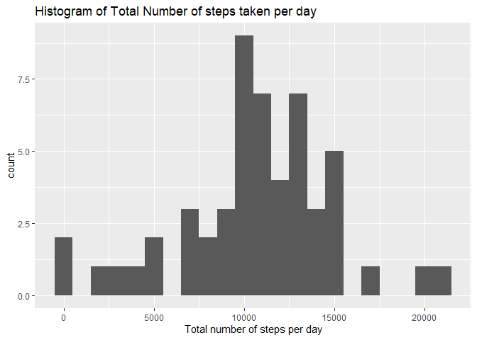
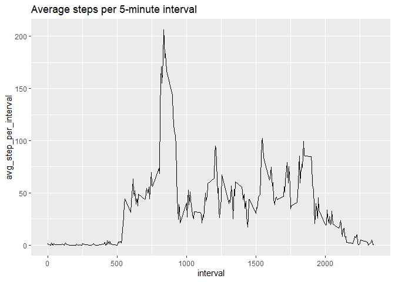
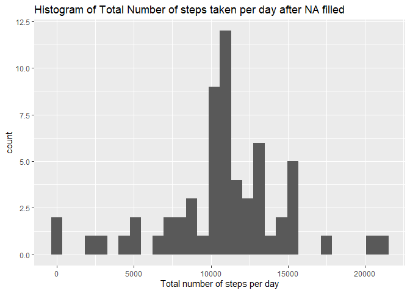
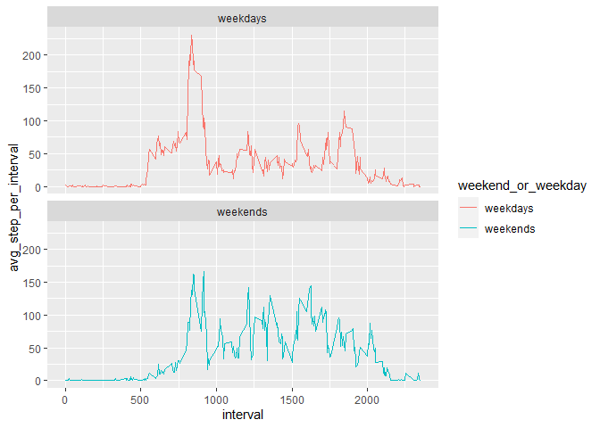

## Loading and preprocessing the data

```r
library(lubridate)
```

```
## 
## Attaching package: 'lubridate'
```

```
## The following objects are masked from 'package:base':
## 
##     date, intersect, setdiff, union
```

```r
library(ggplot2)
library(dplyr)
```

```
## 
## Attaching package: 'dplyr'
```

```
## The following objects are masked from 'package:stats':
## 
##     filter, lag
```

```
## The following objects are masked from 'package:base':
## 
##     intersect, setdiff, setequal, union
```

```r
library(knitr)
library(rmarkdown)
unzip("activity.zip")
data <- read.csv("activity.csv")
```


## What is mean total number of steps taken per day?


```r
total_per_day <- data %>% group_by(date) %>% 
    summarise(total= sum(steps))
ggplot(total_per_day,aes(x = total)) + 
     geom_histogram(binwidth = 1000) + labs(title = "Histogram of Total Number of steps taken per day",x = "Total number of steps per day")
```

```
## Warning: Removed 8 rows containing non-finite values (`stat_bin()`).
```

<!-- -->

```r
(mean_step_per_day <- mean(total_per_day$total,na.rm=TRUE))
```

```
## [1] 10766.19
```

```r
(median_step_per_day <- median(total_per_day$total, na.rm = TRUE))
```

```
## [1] 10765
```


## What is the average daily activity pattern?


```r
step_per_interval <- data %>% 
    group_by(interval) %>%
    summarise(avg_step_per_interval=mean(steps,na.rm= TRUE))
ggplot(step_per_interval, aes(x=interval,y=avg_step_per_interval))+ 
    geom_line() + 
    labs(title="Average steps per 5-minute interval")
```

<!-- -->

```r
index =  which.max(step_per_interval$avg_step_per_interval)
data$interval[index]
```

```
## [1] 835
```


## Imputing missing values


```r
colSums(is.na(data))
```

```
##    steps     date interval 
##     2304        0        0
```

```r
filleddata <- data %>% inner_join(step_per_interval) %>% 
    mutate(steps = ifelse(is.na(steps),avg_step_per_interval,steps)) %>% 
    select(-avg_step_per_interval)
```

```
## Joining with `by = join_by(interval)`
```

```r
total_per_day_filled <- filleddata %>% group_by(date) %>% 
    summarise(total= sum(steps))
ggplot(total_per_day_filled,aes(x = total)) + 
     geom_histogram() + labs(title = "Histogram of Total Number of steps taken per day after NA filled",x = "Total number of steps per day")
```

```
## `stat_bin()` using `bins = 30`. Pick better value with `binwidth`.
```

<!-- -->

```r
(mean_step_per_day_filled <- mean(total_per_day_filled$total,na.rm=TRUE))
```

```
## [1] 10766.19
```

```r
(median_step_per_day_filled <- median(total_per_day_filled$total, na.rm = TRUE))
```

```
## [1] 10766.19
```
Median increased while mean remains the same;

## Are there differences in activity patterns between weekdays and weekends?

```r
filleddataw <- filleddata %>% mutate(wd= weekdays(as.Date(data$date))) %>% 
    mutate(weekend_or_weekday =ifelse(wd %in%c("Saturday","Sunday"),"weekends","weekdays"))

filleddatawavg =filleddataw %>% group_by(weekend_or_weekday,interval) %>% summarise(avg_step_per_interval= mean(steps))
```

```
## `summarise()` has grouped output by 'weekend_or_weekday'. You can override
## using the `.groups` argument.
```

```r
ggplot(filleddatawavg, aes(x=interval,y=avg_step_per_interval,col=weekend_or_weekday))+ geom_line() + facet_wrap(~weekend_or_weekday,nrow=2)
```

<!-- -->

Weekends steps per 5-minute interval are spread out while the weekdays steps per 5-minute has a clear morning surge.
